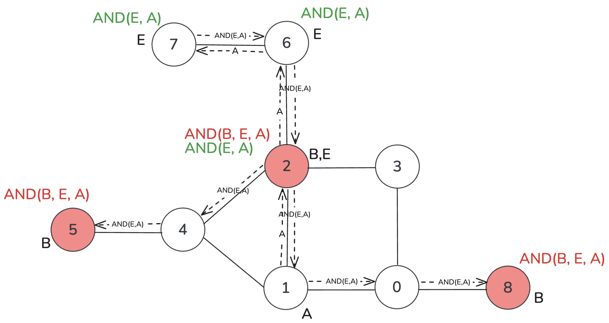
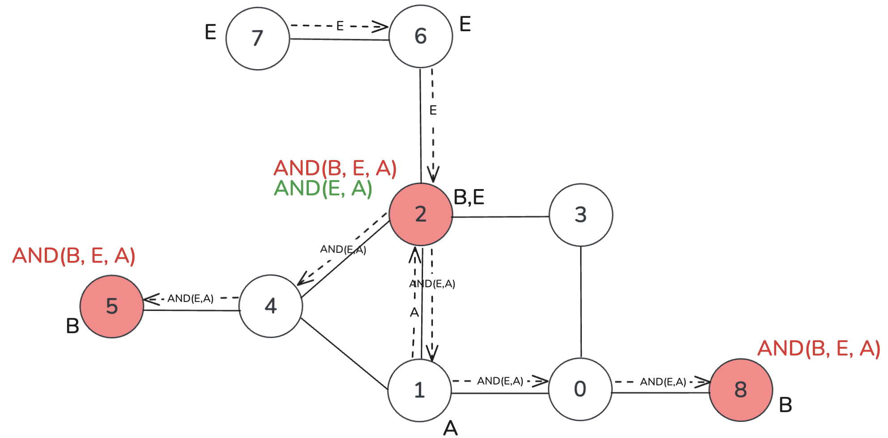
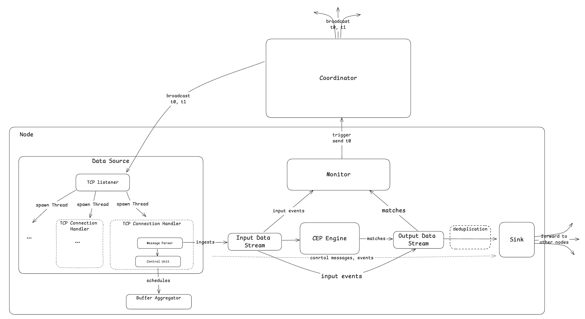
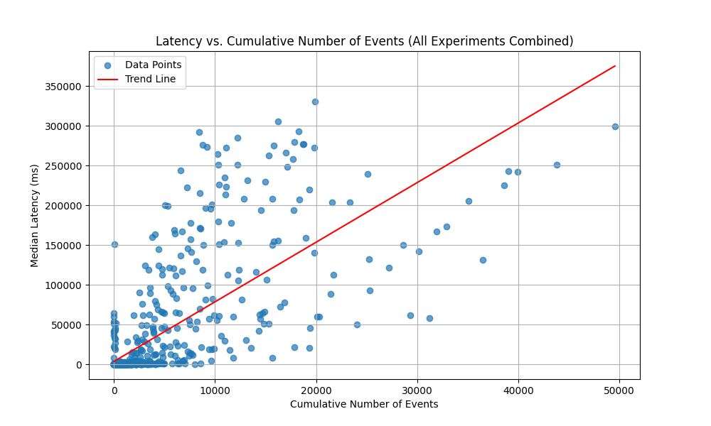

# Flink Multinode

A wrapper around the [Flink Java framework](https://flink.apache.org/) for deploying [INEv](https://dl.acm.org/doi/abs/10.1145/3588955) plans for complex event processing (CEP) with extended functionality. The work in this repository builds on the efforts of S. Akili, S. Purtzel, and D. Pahl[^1] and features adaptivity of the originally generated executution plans to flactuations in event frequency at runtime.

* :mortar_board: This project originated as a product of the research and provides empirical support for the claims made in the [graduation thesis](docs/Bsc_Thesis_Monoinformatik_HU_Kristina_Pianykh.pdf).

* :pencil: Check out my [blog posts](https://kristina-pianykh.github.io/blog/) on the learnings.

## Adaptivity Feature

The core feature is the ability of the deployed system where one of the sub-queries in the evaluation plan has a multi-sink placement to fall back to a single-node placement of the said sub-query as soon as the original plan becomes ineffient. The inefficiency refers to inflated amounts of data transmitted in the network.

  <figure style="margin-right: 10px; text-align: center;">
    
    <figcaption style="font-size: 0.5em; color: grey;">Original Network</figcaption>
  </figure>

  <figure style="text-align: center;">
    
      <figcaption style="font-size: 0.5em; color: grey;">Repaired Network</figcaption>
  </figure>

## Architecture

In brief, each node in the event processing network runs its own instance of the [Flink CEP](https://nightlies.apache.org/flink/flink-docs-master/docs/libs/cep/) engine fronted with a TCP server to process incoming connections and backed with the `Sink` to filter, deduplicate and forward relevant events further. Data is trasmitted using Flink streaming. The `Monitor` component track event rates and triggers the global `Coordinator` component based on the conditions specified in the paper on INEv graphs. The `Coordinator` acts as a centralized manager to [generate a new evaluation plan](https://github.com/Kristina-Pianykh/multisink-adaptive/blob/main/src/main/java/playground/Playground.java) and disseminate it among the nodes.

<figure style="text-align: center;">
  
  <!-- <figcaption style="font-size: 0.9em; color: grey;">System Architecture</figcaption> -->
</figure>

## Limitations (aka Optimization Potential)

* No revert feature for the applied repair
* The repository provides a POC for evaluation plans featuring just one instance of a multi-sink query. This, however, can be extended to be more generic.
* Only `AND` and `SEQ` query operators
* The `Coordinator` components can be integrated with one of the nodes in the network to eliminate the centralization element
* Low data throughput in the Flink CEP engine. A slight increase in data input frequency incurs great processing latency.

<figure style="text-align: center;">
  
  <!-- <figcaption style="font-size: 0.9em; color: grey;">Flink CEP Processing Latency as a Function of Data Input Rate</figcaption> -->
</figure>

[^1]: Affilicated with the Humboldt University of Berlin. The codebase is stored in a private repository on a privately hosted instance of GitLab.
