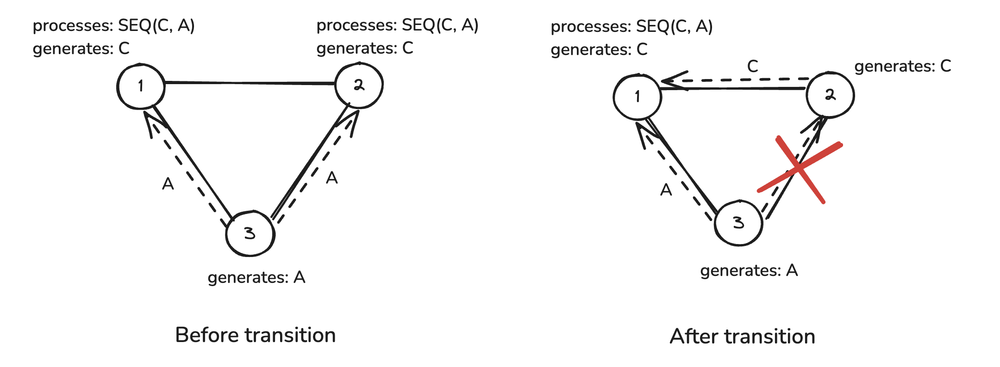
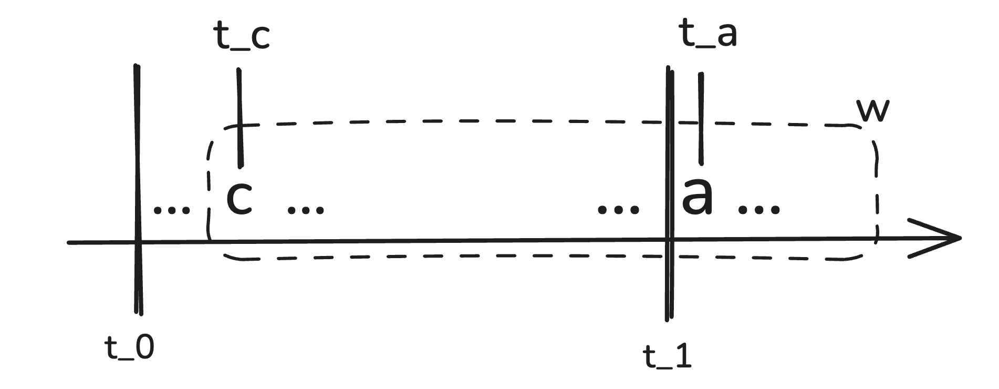

## Motivation

Applications in which the center node is important include information transmission and city planning.
https://appliednetsci.springeropen.com/articles/10.1007/s41109-021-00377-4

## Multi-Node Query Placement

Let Q be a query, i element {0, 1, ... N} be a node in a network of N elements. We call Q a multi-sink query if it is evaluated on multiple nodes M subset of N. For the sake of simplicity, we also call the nodes j element M multi-sink nodes in regard to Q and refer to them as Vmulti. The node with processing Q in a single-node placement of Q is referred to as the fallback node. The inputs for the query Q are referred to by λ(p).

## Problem Formulation

An INEv graph is constructed under the assumption that the event rates remain the same over time. That is, an evaluation plan for the optimized query decomposition and placement is guided, among other factors, by the rates of the inputs for the queries in question. In the real world, however, the idea of fixed rates in a complex distributed setting is rather far-fetched as network communication is extremely volitile by its very nature. In a real world application, such systems rarely exist in isolation, instead they are integrated with data producers which, in their turn, can incur additional latencies and amplify existing flactuations in message frequencies. How can we adapt to these changes in the context of In-Network Evaluation?

The authors of the publication on INEv graph algortihm discuss two potential scenarios when the originally generated evaluation plan can become harmful, i.e. it would inflict higher transmission rates in the system:

1) The output rate of a projection becomes higher than the sum of its input rates.
2) The rate of the non-partitioning inputs of a multi-sink query in a multi-sink placement increases.

The first scenario is analyzed and discussed in detail in [insert unpublish Bachelor thesis]. The second scenario formulates the problem for the current study.

The condition for a multi-node query placement is formulated by the inequality (!!!insert a reference!!!), which justifies a multi-node placement for a projection given the rates of its inputs, the match rate and the distance between the multi-sink nodes. There are two ways in which the inequality might not hold any more. Either the rate of the partitionin input drops or the rates of the non-partitioning inputs increase. While the first scenario would not inflate the network costs, the second scenario can be deemed potentially harmful since it will not only inflict the overhead of forwarding the now high-frequency non-partitioning events to the multiple sinks of the projection but also inflate the match rate. We will therefore focus on mitigating this situation and attempt to offer a repair strategy whose purpose is to keep the transmission costs down (!!! add defintion for transmission/network costs/rates!!!).

## Adaptive Strategy

The main goal of the repair strategy outlined in this study is to prevent network flooding caused by a drastic (as defined above) change in rates of the inputs for a given multi-sink query. The core idea behind it is to redefine the placement query type from multi-node to single-node and instead of exchanging the inputs among the multi-sink nodes forward them all to a single sink. The assumption is that this approach will not only reduce the number of hops the inputs will now have to travel but it will also bring down the output rate of the query since its matches will now only be emitted from a single location. This method, however, poses a number of challenges. How do we determine the node for the single-node placement of Q? How should the forwarding rules for the affected event types change? How should these changes be communicated among the nodes? And, finally, how can we ensure correctness of our evaluation during the transition from multi-node to single-node query placement without bringing the entire system to a halt?

The repair measures needed for the seamless transition of the system from multi-node to a single node-placement can be broken down into a series of steps. These are described below.

1. Monitor event rates and regularly compute the left-hand and right-hand sides of the inequality (reference) to track any drifts in event rates. This functionality is realized through a monitoring component on every node in the network.

2. If the inequality no longer holds, initiate the repair by triggering the coordinator. In other words, as soon as a monitor on a node detects a rate drift, it notifies about it the coordinator component that functions as a centralized coordination unit (more on that below).

3. The coordinator computes a plan for the network in the target state. First, it determines the fallback node for the single-node query placement. The selection is based on the local evaluation plan of the nodes, as well as their connectivity, or reachability, in regard to the rest of the nodes. The first criteria is given a higher priority. For instance, if one of the nodes processing the multi-sink query Q produces one of the query inputs which is a complex query in itself, it will be selected as the fallback node. If none of the nodes in Vmulti processes complex inputs for Q, then the fallback node is selected based on the number of forwarding rules on each of the nodes. In the next step, the coordinator recalculates the forwarding paths for each node to adapt to the placement type by removing the forwarding rules i element λ(p) -> Vmulti ≠ Vfallback on Sp and instead adding the rules i element λ(p) -> Vfallback. Lastly, it computes a timestamp in the future T that represents the time for the transition of the system into the target state. The resulted plan is then broadcasted to all the nodes in the network.

4. The nodes save the updated forwarding table received from the coordinator locally to swap with the original forwarding table at the transition time T. The nodes Vmulti != Vfallback start buffering the partitioning input for a one-time flush to the Vfallback on T. These flushed partitioning input events are then matched on the fallback node with the non-partitioning input events buffered locally. From now on, we are going to refer to this process as retro-spective matching. The buffering of the partitioning input events on the nodes Vmulti != Vfallback and the non-partitioning input events on the fallback node is necessary to avoid any potential data loss due to the transition and ensure correctness of the pattern matching. To illustrate how such data loss can occur in the first place, let us have a look at Figure X.

Figure X displays a simple network of 3 nodes {1, 2, 3}, the nodes generate the following events: {1: C, 2: C, 3: A}. Let us assume that the rate of C events is significantly higher than that of A: r(C) >> r(A) so that the query SEQ(C, A) is placed to be processed at the sources of C events due to their high rates on nodes 1 and 2. There is only one source of A's so we forward them from node 3 to the sinks of SEQ(C, A). If A events suddently increase in their generation frequency to the extent that it inflates the transmission costs in the network, it will trigger the adaptive strategy to take place. Evaluation of the query is removed from node 2 (in this specific topology it could also be node 1) and the forwarding rules change to send the inputs of the query to the fallback node 1. Let t0 and t1 be the timestamps to represent the time at which a drift in event rates was detected and the time for the transition to the single-node query placement, respectively. Let c be an event of type C generated at node 2 time t_c s.t. t0 <= t_c <= t1. Let a be an event of type A generated at time t_a s.t. t1 < t_a (see Figure Y). Then c will not be matched with a if they fall into the same processing window w because c was generated and processed locally at node 2 before the transition took place whereas event a was forwarded only to the fallback node once the system has completed its transition.

The scenario described above illustrates the necessity for a mechanism to prevent data loss and ensure that the query evaluation remains correct. One potential solution to this challenge would be to buffer the partitioning events on Vmulti != Vfallback to use for retrospective matching with non-partitioning events on the fallback node. In our specific example, it would mean that c is flushed to the fallback node 1 on the transition time t1 where it would be combined with a to produce a match.

5. On the time T, specified by the coordinator, the nodes apply the instructions received from the coordinator in beforehand, allowing the system to transition to the sindle-node query placement. The nodes Vmulti != Vfallback flush the buffered partitioning events accumulated from (???) to the fallback node. The fallback node performs retrospective matching with the locally buffered non-partitioning events in addition to the regular query processing.

The notion of a coordinator in 2. introduces a centralized component into our system. While it is possible to integrate this component with one of the nodes in the topology to fit into the distributed paradigm, I opted for the centralized alternative for a number of reasons. First, the coordinating unit does not in any way participate in the data processing or pattern matching; its entire role in narrowed down to one function: time synchronization between the nodes when triggered to initiate the repair.!!!!!!!!!!!!!!!!!!1

The effectiveness of the outlined strategy is evaluated based on the results of experiments in a set of various topologies.

## Topology Criteria

In order to analyze the impact of the adaptive strategy, the variety of topologies selected for running experiments was restricted to meet certain criteria.

1) [Chained network graphs](https://appliednetsci.springeropen.com/articles/10.1007/s41109-021-00377-4) were avoided. This encompasses the graphs of the type G = {V, E}, where V is a set of vertices and E is a set of edges connected the vertices V; the nodes in V can be subdivided into l disjoint sets V = V1 union V2 union V3 union ... union Vl s.t all vertices in the set Vi for i element {1, ..., l} are adjecent only to vertices in the sets V_j-1 or V_j+1 for j element {2, 3, ..., l-1} and |Vi| = 1. Chained graphs can also be considered a refinement of bipartite graphs in which the vertices are connected in a sequential manner. This is due to the fact that if the multi-sink query is placed on the furthest nodes from each other, the partitioning events from one node will still have to be sent all the way to the node on the furthest end of the network, which can obfuscate the effects (??) of the adaptive strategy.

2) There can only be one multi-sink query in the topology. While it is possible to extend the methods developed in this study to topologies with multiple multi-sink queries (see #section with discussion/future studies), this particular study sets its primary focus on eliminating potential noise factors that could arise from increasing the complexity of the network topology.

3) The query operators are restricted to the minimal set of the "AND" and "SEQ" operators.

## Implementation

The implementation, as well as sumilation of a distributed network was carried out on a node with the Apple M2 Pro chip, 10-core CPU and 16GB RAM. The nodes in the implemented system share the same network (regardless of whether they are represented by separate processes on the same host or by separate hosts). The communication among the nodes happens over a network interface by means of exchanging data over TCP sockets. Each node has a monitoring component to keep track of the event rates and continuously recompute both sides of the inequality **X** (!!!refer to the right place!!!) to react to any drifts in event frequencies. The events generated by each node are simulated by a stub service that simply reads a file with event traces (a lits of event timestamps and IDs) and sends them to the respective node. Each node has its own trace generating stub running in a separate process.

## Dependencies

- Python 3.11
- [poetry](https://python-poetry.org/)
- Java 11 (I know alright so SHUT UP)
- maven [3.9.6](https://maven.apache.org/docs/3.9.6/release-notes.html)
- [ripgrep](https://github.com/BurntSushi/ripgrep) (performance-improved grep)
- [bats](https://github.com/bats-core/bats-core) (test suite for bash)
- ~~[nvim](https://github.com/neovim/neovim)~~ (jk, use whatever the hell you want)

## Experiment Design
